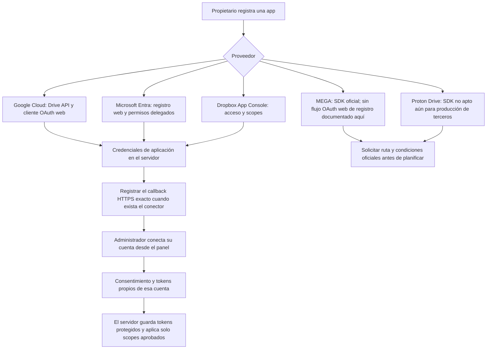

# Registro previo de proveedores de almacenamiento

Esta guía prepara el registro de aplicaciones para posibles conectores futuros de Google Drive, OneDrive, Dropbox, MEGA y Proton Drive. **Este cambio implementa únicamente la carga local de imágenes de productos**: no hay conectores, credenciales OAuth, consentimientos ni cuentas externas configuradas.

## Dos autorizaciones distintas

1. **Registro de la aplicación (desarrollador/propietario del sistema):** crea la identidad de la aplicación en la consola del proveedor y, donde exista, entrega un identificador de cliente y un secreto. Esos datos identifican a All Nutrition como aplicación. Se guardan después en configuración secreta del servidor; nunca en el navegador, en el repositorio ni en el chat.
2. **Autorización de la cuenta (administrador de All Nutrition):** cuando exista un conector real, el administrador iniciará la conexión desde el panel y aprobará los permisos solicitados para su propia cuenta. El proveedor devolverá tokens de usuario; son distintos de las credenciales de la aplicación y deberán persistirse protegidos por el servidor.

Registrar una aplicación no conecta automáticamente la cuenta del administrador. **No registres URI de redirección todavía:** cada proveedor exige coincidencia exacta, y el callback de All Nutrition se definirá al implementar cada conector. No inventes una ruta ni publiques un secreto. Solicita solo permisos de lectura necesarios para elegir y descargar imágenes; el conjunto concreto de scopes debe fijarse con la implementación y verificarse frente a las políticas del proveedor.

## Google Drive

1. En [Google Cloud Console](https://console.cloud.google.com/), crea o selecciona un proyecto del propietario de la aplicación.
2. Habilita **Google Drive API** desde la [biblioteca de APIs](https://console.cloud.google.com/apis/library/drive.googleapis.com).
3. Configura la pantalla de consentimiento OAuth, su audiencia y los datos de contacto/publicación requeridos.
4. En Credenciales, crea un **OAuth client ID** de tipo **Web application**. Añade el URI de redirección HTTPS definitivo solo cuando el callback del conector esté implementado.
5. Conserva el client ID y el client secret en el gestor de secretos del servidor. Solicita únicamente los scopes de Drive que la implementación y la revisión de Google permitan; consultar o descargar archivos existentes puede requerir autorización sensible o restringida y verificación de la aplicación.

Fuentes oficiales: [OAuth 2.0 para aplicaciones web de servidor](https://developers.google.com/identity/protocols/oauth2/web-server) y [Drive API](https://developers.google.com/workspace/drive/api/guides/about-sdk).

## OneDrive (Microsoft Graph)

1. En [Microsoft Entra admin center](https://entra.microsoft.com/), abre **App registrations** y selecciona **New registration**.
2. Elige los tipos de cuenta que realmente usará el titular (solo la organización o también cuentas Microsoft personales). Una vez creado el registro, conserva el **Application (client) ID**.
3. En **Authentication**, añade la plataforma **Web** y registra la URI HTTPS exacta cuando el callback de All Nutrition exista.
4. En **API permissions**, solicita permisos **delegados** de Microsoft Graph de lectura de archivos, no permisos de aplicación que den acceso sin el consentimiento del usuario. Revisa si el tenant exige consentimiento de administrador.
5. Si el flujo de servidor necesita un secreto, créalo en **Certificates & secrets**, guárdalo solo en el servidor y registra su vencimiento para rotarlo antes de que caduque.

Fuentes oficiales: [registro de una aplicación Entra](https://learn.microsoft.com/en-us/entra/identity-platform/quickstart-register-app), [configurar URI de redirección](https://learn.microsoft.com/en-us/entra/identity-platform/how-to-add-redirect-uri) y [flujo OAuth de código de autorización](https://learn.microsoft.com/en-us/entra/identity-platform/v2-oauth2-auth-code-flow).

## Dropbox

1. Inicia sesión en [Dropbox App Console](https://www.dropbox.com/developers/apps) con la cuenta propietaria de la aplicación y crea una app con acceso **Scoped**.
2. Para seleccionar archivos preexistentes de toda la cuenta, elige el modelo de acceso **Full Dropbox** si el diseño final realmente lo requiere; **App Folder** limita el acceso a la carpeta propia de la aplicación.
3. En la pestaña **Permissions**, pide solo los scopes de lectura que necesiten búsqueda/listado y descarga. No habilites escritura si la función solo importa imágenes.
4. En la configuración OAuth, añade el callback HTTPS exacto después de implementar el conector. El App key/client ID y el App secret/client secret son credenciales de aplicación; mantén el secreto exclusivamente en el servidor.

Fuentes oficiales: [OAuth de Dropbox](https://docs.dropboxapi.com/dropbox-api/docs/oauth) y [App Console](https://www.dropbox.com/developers/apps). La publicación o revisión puede ser necesaria según los permisos y el uso final.

## MEGA

La [página oficial para desarrolladores](https://mega.io/developers) publica el **MEGA SDK**, un motor cliente C++ que implementa las operaciones y la criptografía de MEGA. La página no documenta un flujo OAuth web ni una consola pública equivalente para crear client ID, secreto y callback. Por eso no hay credenciales OAuth que se puedan registrar siguiendo las instrucciones oficiales disponibles.

Antes de comprometer un conector web/servidor, consultar a [developers@mega.nz](mailto:developers@mega.nz) sobre el método autorizado para una aplicación comercial, requisitos de acceso y condiciones de licencia. No recopilar contraseñas de MEGA en el panel ni sustituir el SDK por llamadas no documentadas. Referencias: [MEGA SDK](https://github.com/meganz/sdk) y [términos/contacto de MEGA](https://mega.io/developers).

## Proton Drive

**No registrar ni habilitar una integración de producción todavía.** El [SDK oficial de Proton Drive](https://github.com/ProtonDriveApps/sdk) declara que aún no está listo para aplicaciones de terceros en producción y que no proporciona autenticación ni gestión de sesiones. Su documentación no define un registro OAuth para una aplicación web de terceros. La [CLI oficial](https://proton.me/support/drive-cli) es una herramienta de usuario autenticada en navegador, no un registro OAuth para este servidor.

Esperar a que Proton publique un flujo de autenticación y soporte de terceros para producción o entregue instrucciones oficiales específicas para este caso. No pedir ni almacenar la contraseña del usuario, no reutilizar credenciales de CLI y no imitar los clientes propios de Proton.

## Alcance de la carga actual e iCloud

Las conexiones anteriores son futuras y no participan en la carga local. En **Productos**, el panel acepta JPEG/JPG, PNG y WebP de hasta 10 MiB, optimiza la imagen a WebP, conserva la proporción y limita cada lado a 2400 px. Los archivos se sirven desde almacenamiento persistente local con una cuota total de 1.000.000.000 bytes. Si el selector de archivos del dispositivo ofrece un archivo compatible procedente de iCloud Drive, puede elegirse como archivo local; se sube al servidor y cuenta para la misma cuota. No existe una conexión de cuenta iCloud.

